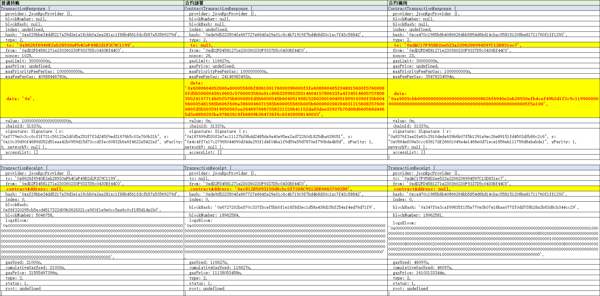

# 区块链基本交互操作

### 整体介绍

区块链交互，本质上都是在发送交易。

有三种类型的交易：

- 普通转账交易：交易报文中，to为目标地址，data为空。回执中contractAddress为空。
- 部署合约交易：交易报文中，to为空，data合约创建字节码。回执中contractAddress为创建的合约地址。
- 调用合约交易：交易报文中，to为合约地址，data为调用编码（函数选择器+参数）。回执中contractAddress为空。


### 调用命令

普通转账交易：
```
npx hardhat run .\scripts\wallet_transfer.ts --network localhost
```
部署合约交易：
```
npx hardhat run .\scripts\contract_deploy.ts --network localhost
```
调用合约交易：
```
npx hardhat run .\scripts\contract_swap.ts --network localhost
npx hardhat run .\scripts\contract_transfer.ts --network localhost
```

打印输出三种交易的报文和回执数据，详见下方表格：


